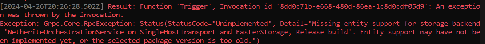

# .NET 8 Isolated function APP

## Memory consumption with Netherite

**Startup**

**After a few requests**

## Isolated entities support with netherite
Hitting the endpoint [GET] http://localhost:7161/api/Trigger which tries to signal the entity `Counter` will throw the following exception:

Support for isolated entities in netherite [has not been released.](https://github.com/microsoft/durabletask-netherite/issues/361#issuecomment-2005172334)

